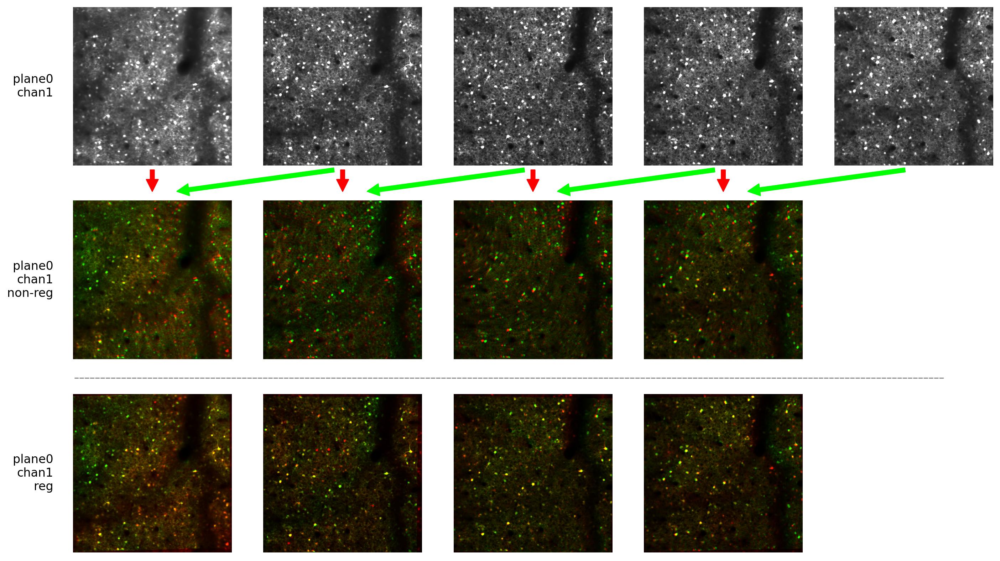
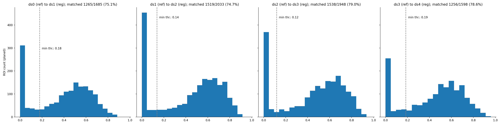
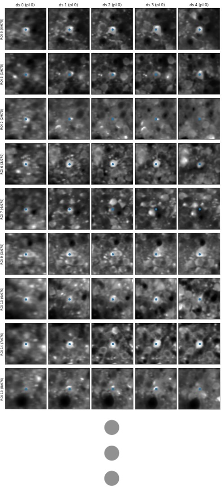

# track2p
Cell tracking for longitudinal calcium imaging recordings.

# Installation

## Setting up the environment

First make sure that you have an updated version of conda installed (the procedure below is based on conda 23.11.0).

Next, set up conda environment with python 3.9:

```
conda create --name track2p python=3.9
conda activate track2p
```

Install dependencies:
```
conda install -c conda-forge matplotlib
conda install -c conda-forge numpy
conda install -c conda-forge scikit-image
pip install itk-elastix
```

Additionally if using the `demo.ipynb` notebook you should install jupyter, for example:
```
conda install conda-forge::jupyterlab
```

### Platform specific installation issues/requirements:
MacOS Sonoma: You might need to have xcode enabled during installation. If you run into `xcrun: error: invalid active developer path .../.../... , missing xcrun at .../.../... ` then enable xcode by running: `xcode-select --install
`

Linux Ubuntu: (not tested yet)

Windows: (not tested yet)

## Setting up track2p

For now track2p can only be installed from source via GitHub (TODO: make pip-installable)

For this first clone the repo:
```
git clone https://github.com/juremaj/track2p
```

cd to the root directory:
```
cd track2p
```

And install the local package (all modules within the track2p/track2p subfolder):
```
pip install -e .
```

# Usage

## Simple usage

The current version (v1.0.0) is not extremely user friendly, but this will be improved soon.

The best is just to run jupyter from your environment:

```
conda activate track2p
cd track2p
jupyter lab
```

And then open `demo.ipynb`, where you can then set the paths to the suite2p output directories of the datasets to be matched, as well as the path where the outputs should be saved.

## Changing algorithm parameters

TODO: add documentation of algorithm parameters (for now use the defaults saved at `track2p/ops/default.py`, they should work well)

# Outputs

All the outputs of the script will be saved in a `track2p` folder created within the `track_ops.save_path` directory specified by the user in the Jupyter notebook. 

## Matches

There are two types of output from track2p:

- A matrix (`plane#_match_mat.npy`) containing the indices of matched neurons across the session for a given plane (`#` is the index of the plane). Since matching is done from first day to last, some neurons will not be sucessfully tracked after one or a few days. In this case the matrix contains `None` values. To get neurons tracked across all days only take the rows of the matrices containing no `None` values. 

- A `track_ops.npy` object that contains the parameters used for the algorithm and some intermediate results that can be used for visualisations (e. g. registered images and ROIs etc.)


## Visualisations

There are several visualisations that can be used to evaluate the registration and cell matching quality. These will all be saved in the path defined by `track_ops.save_path` under `track2p/fig`

The figures are the following (in the order of importance):

- `reg_img_output.png` image visualising the quality of image registration across the two days. Each pair of recordings is visualised as red/green overlay of the mean images on the two days before (above) and after (below) registration. If the bottom images don't show good alignment the output of the algorithm would be completely useless (if this happen make sure everyhting is correct with the data)



- `thr_met_hist.png` visualises the IOU of the matched ROIs. TODO: document how the algorithm works, this will make it clearer. For now refer to other examples for explanation e. g. https://www.cell.com/cell-reports/pdf/S2211-1247(17)31430-4.pdf



- `roi_match_plane#_idx###-###.png` visualises a window of the mean gcamp image around an example match for all days. If there is more than 100 matches, they are split to separate figures. The dot in the middle shows the centroid of the ROI (whole ROI is not drawn to not bias the estimation of match).



- `all_roi_match.png` visualises all matches across the FOV for all days. Here the full ROIs are drawn and the color is maintained across days.


