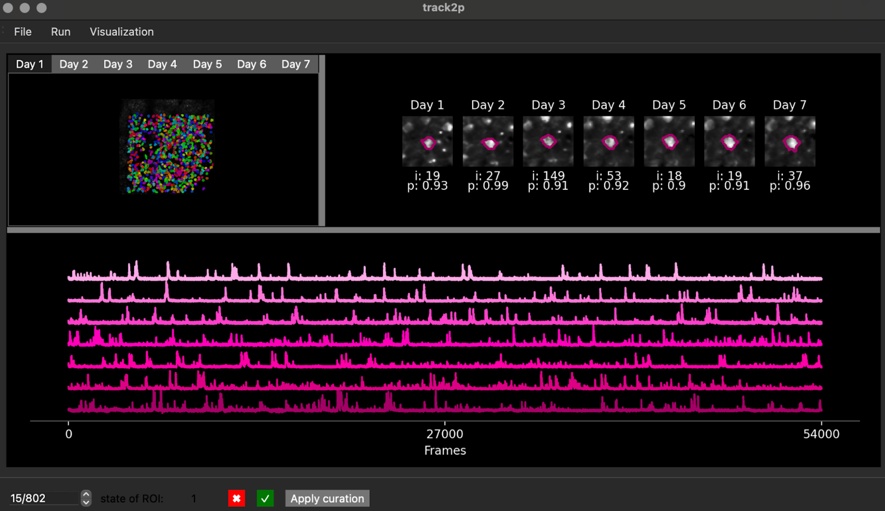

# track2p 


<div style="width: 75%; height: 1px; background-color: black;"></div>

Cell tracking for longitudinal calcium imaging recordings.

[](https://pypi.org/project/track2p/)
[](https://pepy.tech/project/track2p)
[](https://pypi.org/project/track2p/)
[](https://www.gnu.org/licenses/gpl-3.0)

For more detailed information on installation and use visit:

https://track2p.github.io/ 
<br/>
<br/>
Or read the [preprint](https://www.biorxiv.org/content/10.1101/2025.02.26.640367v1).
<br/>
<br/>

# Installation

## Installing via pip

First we need to set up a conda environment with python 3.9:

```
conda create --name track2p python=3.9
conda activate track2p
```

Then simply install the track2p package using pip:

```
pip install track2p
```

Thats it, track2p should be succesfully set up :)
You can simply run it by:

```
python -m track2p
```

This opens a GUI allowing the user to launch the algorithm and visualise the results interactively.

(For instructions on running track2p without the GUI see the 'Run via script' under the 'Usage' section)

Note: For common installation issues see ['Installation > Common issues'](https://track2p.github.io/install_common_issues.html) in documentation.

## Reinstall

To reinstall, open anaconda and remove the environment with:

```
conda env remove -n track2p
```

Then follow the 'Installing via pip' instructions above :)


# Usage

## Run track2p through the GUI

After activating the GUI through `python -m track2p` the user should navigate to the 'Run' tab on the top left of the window and select 'Run track2p algorithm' from the dropdown menu.

This will open a pop-up window that will allow the user to set the paths to suite2p datasets and to set the algorithm parameters. After configuring these settings, the user can click 'Run' to run the track2p algorithm, and the progress will be displayed in the terminal.

Once the algorithm finishes a subsequent pop-up window will prompt the user to decide whether they wish to visualize the results within the interface.

For more details on how to run the algorithm through the GUI see [run track2p](https://github.com/juremaj/track2p/blob/main/docs/run_track2p.md) and for more description of parameters see documentation [parameters](https://github.com/juremaj/track2p/blob/main/docs/parameters.md).

## Run track2p via script

To run via script you can use the `run_track2p.py` script in the root of this repo as a template. It is exactly the same as running thrugh the gui, only that the paths and the parameters are defined within the script (for more on parameters etc. see documentation). When running make sure you are running it within the track2p environment, for example:

```
conda activate track2p
python -m run_track2p
```


## Visualising track2p outputs within the GUI

_ _ Note: For we assume that each of the to-be-matched recordings is done at the **same imaging frequency**, for the same **imaging time**, contains the same **number of planes** and **number of imaging channels** (otherwise we can not guarantee track2p will work)_ _

After activating the GUI through python -m track2p the user can import the results of any previous analysis by clicking on 'File' tab on the top left of the window and select 'Load processed data' from the dropdown menu. This will open a pop-up window that will allow the user to set the path to the track2p folder (containing the results of the algorithm) and the plane they want to open. 

Once completed, the interface showcases multiple visualizations:



In this example we are using the track2p GUI to visualise the outputs for an experiment containing 7 consecutive daily recordings in mouse barrel cortex (between P8 and P14).

In the upper left, the GUI visualises the mean image of the motion-corrected functional channel (usually green / GCaMP). The image is overlayed with ROIs of the cells detected by track2p across all days, with the color of a particular cell matching across days. These images are interactive, allowing the user to click on a cell, which displays the fluorescence traces on each day at the bottom of the window (sorted from the first day to the last). 

In addition, a zoomed-in image of the cell for each day is shown in the top right. Underneath each zoomed-in image the GUI displays this cell's index in the corresponding 'suite2p’ dataset and the 'iscell' probability suite2p has assigned to it on that day.

Finally, the user can browse all the putative matches detected by the algorithm using the bar at the bottom to toggle through matches, or alternatively they can enter the index of a specific number to display it within the GUI. This bar is also used for manual curation, where we allow the user to evaluate the quality of the tracking for each individual match.

For more details on how to use the GUI see [GUI usage](https://github.com/juremaj/track2p/blob/main/docs/gui.md)


# Outputs

All the outputs of the script will be saved in a `track2p` folder created within the `track_ops.save_path` directory specified by the user when running the algorithm. For an introduction on how to use the outputs for further downstream analysis we provide a useful demo notebook `demo_t2p_output.ipynb` in the root of this repository. Note: You will need to additionally install jupyter for this to work. For example:

```
conda install conda-forge::jupyterlab
```

For more information see documentation relating to track2p [viusalisations](https://github.com/juremaj/track2p/blob/main/docs/visualisations.md) and [outputs](https://github.com/juremaj/track2p/blob/main/docs/outputs.md).

# Reference

For now if you use the algorithm please reference the [preprint](https://www.biorxiv.org/content/10.1101/2025.02.26.640367v1):

  **Majnik, J., Mantez, M., Zangila, S., Bugeon S., Guignard L., Platel, J. C. & Cossart, R. (2025). _Longitudinal tracking of neuronal activity from the same cells in the developing brain using Track2p_. bioRxiv.**

You can also see a Youtube recording of a talk related to the preprint: [Link to video (starting at 47:20)](https://youtu.be/Tr97HwgQ9ik?t=2839)

___


By Cossart Lab (Jure Majnik & Manon Mantez) 

Logo by Eleonora Ambrad Giovannetti 

© Copyright 2025.
