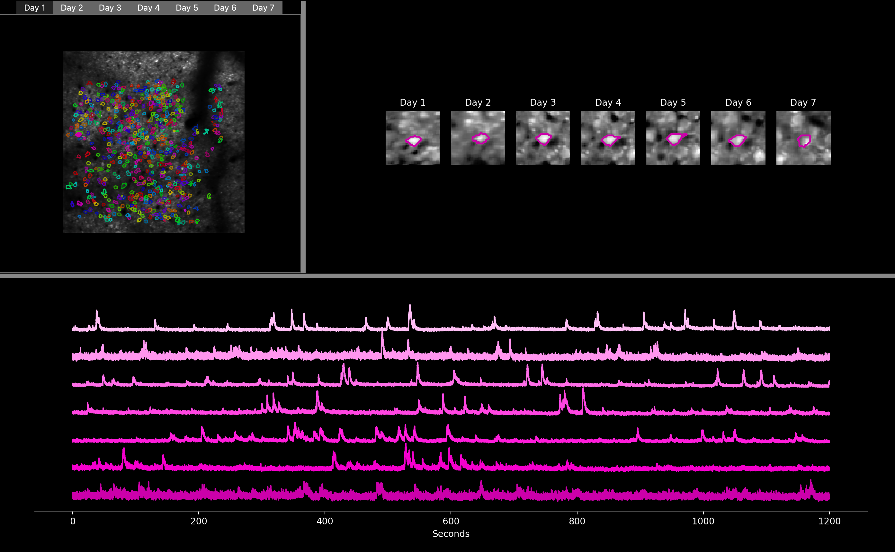

# track2p
Cell tracking for longitudinal calcium imaging recordings.

[](https://pypi.org/project/track2p/)
[](https://pepy.tech/project/track2p)
[](https://pypi.org/project/track2p/)
[](https://www.gnu.org/licenses/gpl-3.0)

___
Note: We are actively developing the software for the next couple of months, so we would greatly appreciate any feedback! You can raise it as an [issue](https://github.com/juremaj/track2p/issues) on GitHub or contact us directly. Thanks!
___


# Installation

## Installing via pip

First we need to set up a conda environment with python 3.9:

```
conda create --name track2p python=3.9
conda activate track2p
```

Then simply install the track2p package using pip:

```
pip install track2p
```

Thats it, track2p should be succesfully set up :)
You can simply run it by:

```
python -m track2p
```

This opens a GUI allowing the user to launch the algorithm and visualise the results interactively.

(For instructions on running track2p without the GUI see the 'Run via script' under the 'Usage' section)

Note: For common installation issues see [documentation](https://github.com/juremaj/track2p/blob/main/docs/installation.md).

# Usage

## Run through GUI

After activating the GUI through `python -m track2p` the user should navigate to the 'Run' tab on the top left of the window and select 'Run algorithm' from the dropdown menu. This will open a pop-up window that will allow the user to set the paths to suite2p datasets and to set the algorithm parameters. Once these have been set the user can click on 'Run', which will launch the track2p algorithm, with the progress being printed in the window below.

When the algorithm is finished, another pop-up window will appear, asking the user if they want to visualise the outputs in the GUI.

For more details on how to run the algorithm through the GUI see [documentation](https://github.com/juremaj/track2p/blob/main/docs/gui.md) and for more description of paramters see documentation [here](https://github.com/juremaj/track2p/blob/main/docs/parameters.md).

## GUI visualisation


The GUI supports both visualisation after algorithm run (as described above), as well as visualising previously processed data. The latter can be done by navigating to File -> Load processed data on the top left of the GUI.




Briefly the GUI allows the user to visualise the mean field of view on all days, with the ROIs of all matched cells visualised. The user can then interactively select a cell by clicking on the ROI on the mean image. This will display a zoomed-in view of this cell across all days on the right, and the extracted fluorescence time series below.

For more details on how to use the GUI for visualising track2p results see [documentation](https://github.com/juremaj/track2p/blob/main/docs/gui.md).

## Run via script

To run via script you can use the `run_track2p.py` script in the root of this repo as a template. It is exactly the same as running thrugh the gui, only that the paths and the parameters are defined within the script (for more on parameters etc. see documentation). When running make sure you are running it within the track2p environment, for example:

```
conda activate track2p
python -m run_track2p
```

# Outputs

All the outputs of the script will be saved in a `track2p` folder created within the `track_ops.save_path` directory specified by the user when running the algorithm. For an introduction on how to use the outputs for further downstream analysis we provide a useful demo notebook `demo_t2p_output.ipynb` in the root of this repository. Note: You will need to additionally install jupyter for this to work. For example:

```
conda install conda-forge::jupyterlab
```

For more information see documentation relating to track2p [viusalisations](https://github.com/juremaj/track2p/blob/main/docs/visualisations.md) and [outputs](https://github.com/juremaj/track2p/blob/main/docs/outputs.md).

# Reference

For now if you use the algorithm please reference the Cosyne abstract:

  **Majnik, J., Zangila, S., Cossart, R. & Platel, J. C. (2024). _Emergence of state modulation in a developing cortical circuit_. COSYNE Abstract.**

  

You can also see the YouTube recording of the talk for a reference use-case in neocortical development: [Link to video (starting at 47:20)](https://youtu.be/Tr97HwgQ9ik?t=2839)
