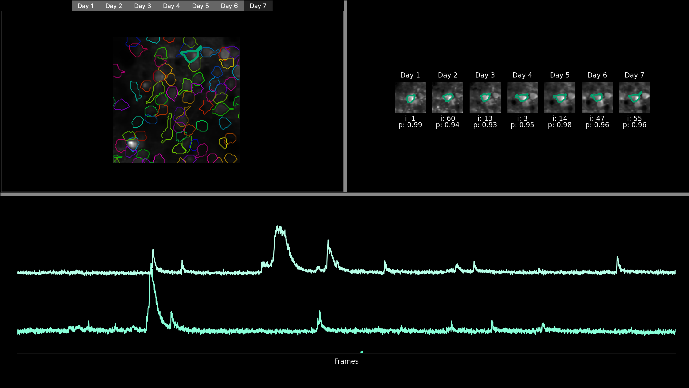
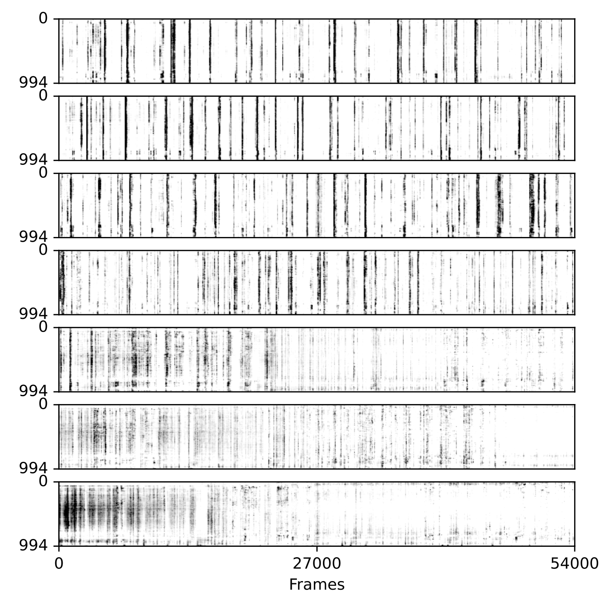

# GUI usage

## Toolbar

The user has three buttons on the toolbar:

- `Run` : launches the algorithm.
- `File` : imports data already processed by the algorithm.
- `Visualization` : allows results to be visualized using raster plots, providing a graphical representation of neuronal activity of the whole matched population over time (for more details, see section 'Raster plot' below).

## Central window

The central area of the interface presents various visualizations.

In the top left part, users can find a mean image displayed for each recording, labeled with the corresponding day number (e.g., day1, day2, etc.). Each image is also overlayed with the ROIs of the cells that are matched across all days, with the color of a particular match staying the same across days. Users can navigate through these images across days by clicking on the tabs representing each day. Additionally, users have the option to zoom into specific regions of the image and click on individual cell to highlight it.

Once a cell is selected, a cropped, zoomed-in view of a small surrounding part of the field of view is visualised for each day and displayed in the top right-hand corner with the ROI of the selected cell highlighted (a window of 40x40 pixels around the ROI centroid is used currently).

At the bottom  of the GUI, users can view the fluorescence trace of the selected cell for each recording. The tracks are organized chronologically, with the track at the top corresponding to the first day of recording, followed by the following days. To further analyze these traces, users can zoom in by drawing a rectangle from the bottom left corner to the top right corner of the trace. After drawing the rectangle, they can zoom in by pressing 'enter' and zoom out by pressing 'r'.

Here, the user has zommed on a specific cell as well as on the fluorescence of the two first days (recording of developing mouse barrel cortex for consecutive 7 days)

## Bottom bar

The bottom bar is divided into several parts:

- A text box with an up-down control: the user can browse all matches detected by the algorithm as present across all days, and all central window information will be updated according to the cell selected.

The interface allows the user to curate the results of the algorithm's multi-day cell tracking. On initialization, all cells detected as being correctly tracked each day by our algorithm have a status of 1. This information is stored in `track_ops.vector_curation` (see [parameters](https://github.com/juremaj/track2p/blob/main/docs/parameters.md))

However, the user can assess the quality of cell tracking and activity by inspecting ROIs, zoomed images and the fluorescence traces across days. Subsequently, adjustments can be made to the status of a cell within track_ops.vector_curation through the interface.

- State of ROI : informs the user of the current cell status stored in track_ops.npy
- ✅ : is used to set the cell state to 1 in track_ops.vector_curation
- ❌ : is used to set the cell state to 0 in track_ops.vector_curation
- Apply curation : is used to apply the curation to the GUI. When the user clicks on this button, all cells with a status of 0 will be **white**, while those with a status of 1 will be **colored**. **Note**: This button only affects the GUI visualisation. It is not necessary to click this button to save the curation to `track_ops.vector_curation`, this is done automatically when the status of the cell is changed by the user.

Below is an example of a cell labelled as 'not cell' by the user (recording of developing mouse barrel cortex for consecutive 7 days)

## Raster plot 

To generate raster plots, the user should launch the GUI through `python -m track2p` and navigate to the 'Visualization' tab on the top of the window and select 'Generate raster plot' from the dropdown menu. This will open a pop-up window that will allow the user to set the path to track2p output folder and to set several parameters.

IMAGE

The user can use `PCA`(Principal Component Analysis) and `t-SNE` (t-distributed Stochastic Neighbor Embedding) techniques to re-sort the rasters based on dimensionality reduction. This allows for more intuitive visualisations that can reveal structure within the neuronal activity traces. Additionally, this sorting can be applied for a specific day and applied to all other days. This makes it possible to analyze variations in cell activity from day to day by perserving the sorting of the matched cells.

The user can also enter advanced settings:

- Averaging bin size : to smooth the plot raster data over a defined time interval. (Note: currently, the total number of frames of the recurding should be divisible with the entered number)
- vmin and vmax parameters allow to adjust the contrast

Below is an example of a raster plot generated using tsne for sorting, the sorting was computed on last day and each 10 time frames were averaged to smooth the data (recording of developing mouse barrel cortex for consecutive 7 days).

  
