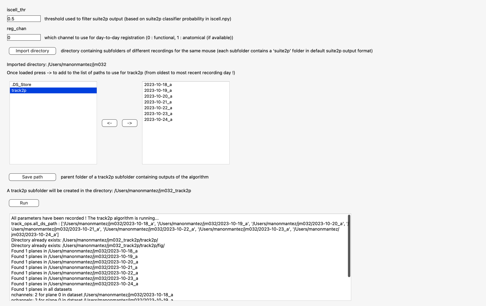
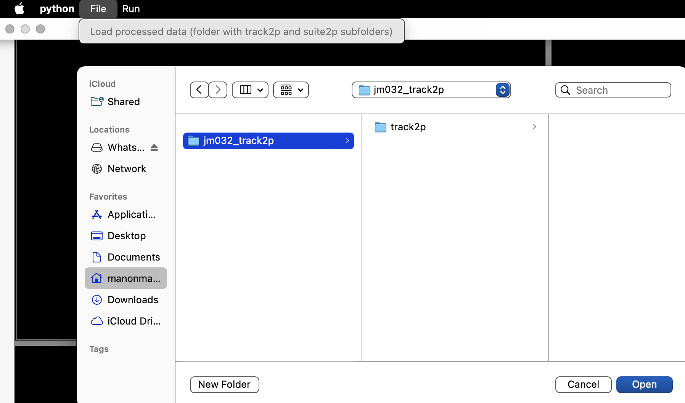
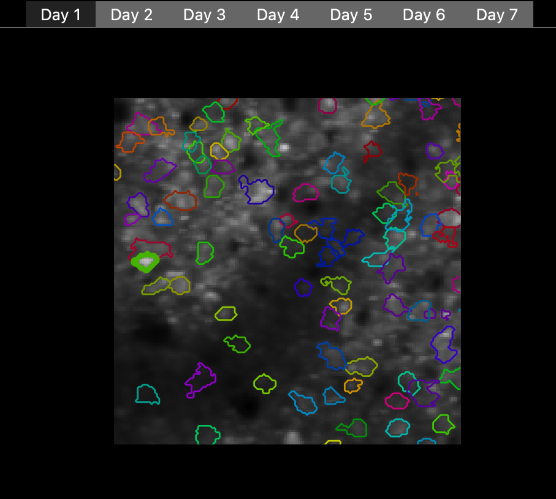
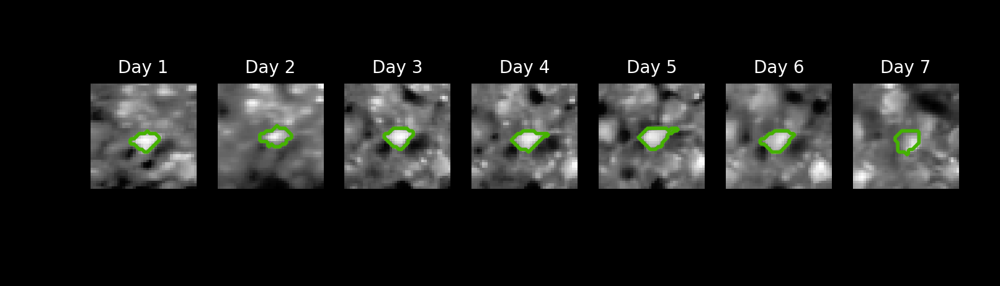

# Run track2P through gui 

After activating the GUI through `python -m track2p` the user should navigate to the 'Run' tab on the top left of the window and select 'Run track2p algorithm' from the dropdown menu. This will open a pop-up window that will allow the user to set the paths to suite2p datasets and to set the algorithm parameters (see an example below). 

 

- Iscell_thr input textbox: the user must enter the threshold used to filter suite2p outputs (based on suite2p classifier probability in iscell.npy). The default value is 0.5.
  
- Reg_chan input textbox : the user must enter which channel to use for day-to-day registration (0-> functional 1-> anatomical (if available)). The default value is 0.
  
- Import directory button : the user has to import the directory containing subfolders of different recordings for the same mouse (each subfolder contains a ‘suite2p’ folder in default suite2p output format). Once imported, the directory path will be displayed (Imported directory: directory path) and all subfolders in the directory are displayed in the left-hand box (in alphabetical order). Next, the user must press -> to add the file to the list of paths to use for track2p in the right-hand box (the user can import subfolders from different directories).

***Warning: to avoid mismatch between ordered recording days and days that are displayed in the gui, the user should list the subfolders from oldest to most recent recording day in the right-hand box, so that the first day of recording (oldest day) correspond to the first day in the gui and so on.***
  
- Save path button : the user must import the parent folder in which they desire to put a track2p subfolder containing outputs of the algorithm.
  
- Run button: it allows the user to launch the track2p algorithm and initiates the terminal that displays messages informing about the algorithm's progress.

When the algorithm is finished, another pop-up window will appear, asking the user if they want to visualise the outputs in the GUI. If the user click on yes, all vizualizations will be displayed (see visualisations section). 

# Load track2p processed data through gui

Here we assume that each of the recording is **same length**, **imaging frequency**, **number of planes** and **number of channels** (otherwise might not work, or we cant guarantee). Moreover, for now the gui processes and displays only visualizations relating to `plane0`. 

The GUI supports both visualisation after algorithm run (as described above), as well as visualising previously processed data. The latter can be done by navigating to File -> Load processed data on the top left of the GUI. The user must import the directory containing the track2p subfolder with outputs of the algorithm (see example below).

***Warning : to avoid an error, don't remove or rename suite2p data after track2p run. Indeed, the gui uses the paths of suite2p data that have been saved in `track_ops.npy`.***

 

# Visualisations

The gui is divided into 3 parts: 

- In the top left-hand corner, the mean image for each recording is displayed in a tab named according to the recording day number (day1, day2 ...). The user can navigate through these tabs by clicking on them. Each mean image is interactive, so that the use can zoom in on ROIs and zoom out, once in the desired ROI the user can click on a cell which be highlighted.

 

Once the cell is clicked: 

- In the top right-hand corner a zoom (window of 40 pixels around the cell) from each mean image is displayed.

 
  
- At the bottom, the cell's fluorescence trace for each recording (per time bin) are displayed. The fluorescence trace at the top of the plot corresponds to the first day of registration and so on. The user can zoom in by drawing a rectangle *from the bottom left corner to the top right corner* as many times as desired. Once the rectangle has been drawn, the user must issue the following command: `cmd + =` to zoom in and `cmd + -` to zoom out.

