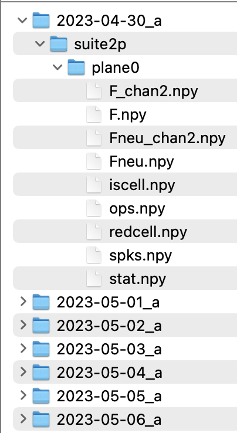
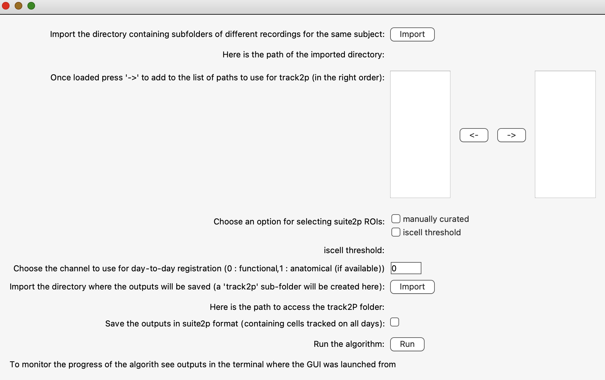

### --- UNDER CONSTRUCTION ---

# Run track2p through the GUI

After activating the GUI through `python -m track2p` the user should navigate to the 'Run' tab on the top left of the window and select 'Run track2p algorithm' from the dropdown menu.

This will open a pop-up window that will allow the user to set the paths to suite2p datasets and to set the algorithm parameters. After configuring these settings, the user can click 'Run' to run the track2p algorithm, and the progress will be displayed in the terminal.

Once the algorithm finishes a subsequent pop-up window will prompt the user to decide whether they wish to visualize the results within the interface.

## Suite2p dataset organization

_ _Warning: to avoid issues with loading data, avoid modifying the paths where the suite2p datasets are stored after running track2p. This is because the interface uses the paths to the suite2p datasets saved in `track_ops.npy` (`track_ops.all_ds_path`)_ _

We assume each of the recordings that are to be matched contains processed data in the default 'suite2p format'. In that case each recording folder has a subfolder named 'suite2p', which in terms contains one sub-folder per plane. Each of these subfolders contains the usual suite2p outputs for the neurons recorded within that plane (see: https://suite2p.readthedocs.io/en/latest/outputs.html). In the case of running suite2p individually for simultaneously recorded planes, the user can reconstruct this convention by putting the results of the second suite2p run to a manually added 'plane1' subfolder etc.

Below is an example of file organisation for a mouse imaged over 7 days (single plane). 

## Run track2p

The algorithm launch window is structured like a form and instructions are provided next to each parameter to be entered.

### Paths
This is where the user selects the suite2p directories that are to be processed by the algorithm. We recommend that all the recordings that are to be matched reside wihtin the same parent directory, however this is not strictly necessary. For example above `2023-04-05_a`, `2023-04-06_a` ... all reside in a folder specific for that mouse. When clicking on 'import' the user can then navigate to that parent directory and select subfolders (datasets such as `2023-04-05_a`) individually to move them to the right hand column using the arrows underneath the list.

 **Note:** when selecting suite2p datasets the order in which they are passed to the right side column matters, since the recordings will be matched in this order. We recommend the most straightforward way of selecting the datasets in chronological order. In this way, the first day of recording will correspond to day 1 in the interface. 

### Options

You can choose between `manually curated` and `iscell threshold`. Choosing 'manually curated' means that manual adjustments made by the user in the Suite2p interface will be taken into account. As a reminder, Suite2p detects regions of interest (ROIs) in an automated manner. After this detection, users can annotate each ROI by manually classifying them as “cell” or “not cell”. By selecting the 'manually curated' option, the algorithm will only test ROIs classified as “cell” for matching with other days of recordings. On the other hand, when selecting 'iscell_thr', the manual curation is ignored (if it exists) and instead the suite2p's classifier values are considered (see: https://suite2p.readthedocs.io/en/latest/gui.html#classifying-cells). Only ROIs to which the Suite2p classifier assigns a value above this threshold will be considered for tracking by the algorithm.

**Note1:** Despite the manual curation on idividual recordings it is still important for the user to manually inspect the matches, since curation on individual datasets does not necessarily imply a good quality of registration across days.

**Note2:** Depending on the application it can be better to run the matching without manual suite2p curation and using a slightly reduced `iscell_thr`, for example 0.25. This ensures more matches and ensures successful tracking even if a cell has a value slightly below threshold on one of the days for example. In this case all the manual curation can be done within the track2p GUI.

Another option that we offer to the user is to tick the option `Save the outputs in suite2p format (containing cells tracked on all days)`. In this case, the gui will save a version of the Suite2p datasets (stat.npy, iscell.npy, F.npy..) containing only the cells tracked on all days. Additionally, the data saved in the 'matched suite2p' format is re-ordered in a way that the cell index 0 on the first day will correspond to cell index 0 on the second day etc. The user can then use this data as they would normally with the suite2p gui, for example by dragging and dropping stats.npy files for different days. The cells in this case will have the same color on different days, and examine for example ROI 0 for each day, the user can see that it corresponds to the same cell for all different days. The data saved in the 'matched suite2p' format will be located in a  `matched_suite2p` folder inside the track2p folder, and will be organised in the same way as the original data (in default suite2p format, for more information see above).

##### TODO:
(Add figure of mathed ROIs: ... _Below, a figure illustrates an example of the original 'suite2p' datasets for 7 days of recording a mouse (first row), as well as the 'suite2p' datasets generated by track2p (second row), containing only the cells present every day._)

