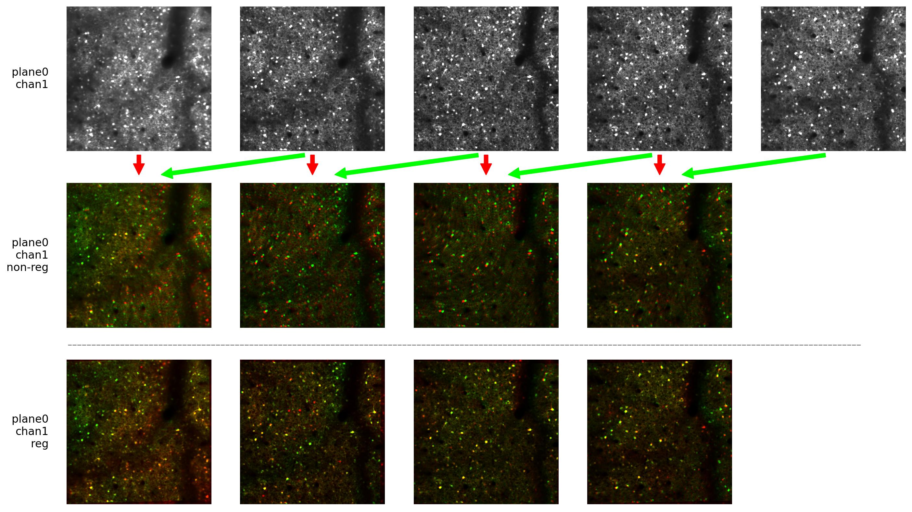
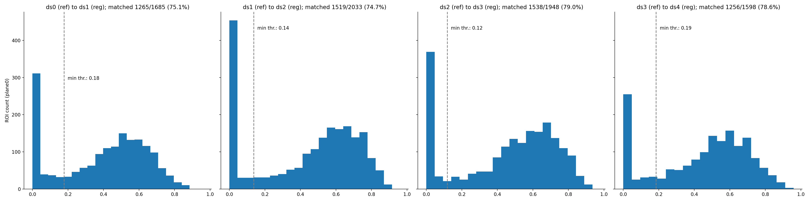
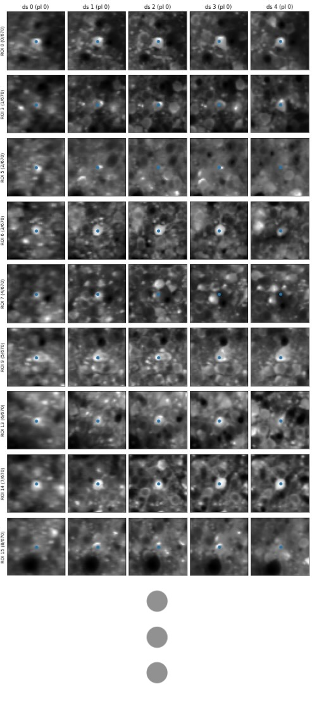

### --- UNDER CONSTRUCTION ---

## Visualisations

There are several visualisations that can be used to evaluate the registration and cell matching quality (these figures are generated automatically when running the algorithm). These will all be saved in the path defined by `track_ops.save_path` under `track2p/fig`

The figures are the following (in the order of importance):

- `reg_img_output.png` image visualising the quality of image registration across the two days. Each pair of recordings is visualised as red/green overlay of the mean images on the two days before (above) and after (below) registration. If the bottom images don't show good alignment the output of the algorithm would be completely useless (if this happen make sure everyhting is correct with the data)

- `thr_met_hist.png` visualises the IOU of the matched ROIs. TODO: document how the algorithm works, this will make it clearer. For now refer to other examples for explanation e. g. https://www.cell.com/cell-reports/pdf/S2211-1247(17)31430-4.pdf

- `roi_match_plane#_idx###-###.png` visualises a window of the mean gcamp image around an example match for all days. If there is more than 100 matches, they are split to separate figures. The dot in the middle shows the centroid of the ROI (whole ROI is not drawn to not bias the estimation of match).

- `all_roi_match.png` visualises all matches across the FOV for all days. Here the full ROIs are drawn and the color is maintained across days.

